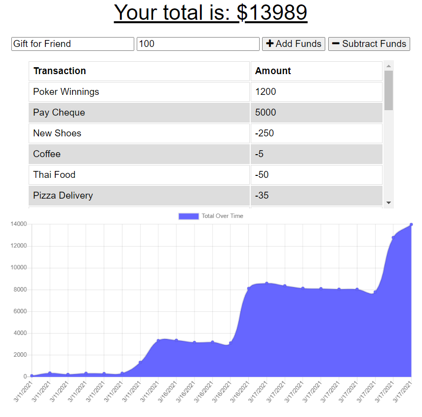

# ProgressiveBudget18

# Project Title: Progressive Budget Application

## Description: The Progressive Budget Application is a Budget Tracker that allows users to add expenses and deposits to their budget with or without a connection. 

 ## Usage: The application will be invoked by using the following:

 * Node server.js via integrated terminal
 * Open browser and go to localhost:3000
 * From there you should have the application successfully launched. Then you can go ahead and name your transaction and input a transaction amount. You can input a transaction using "add funds" for deposit and "subract funds" for expense. 
 

 ## Contributing:
 * Contributions made by Jordan Mossing using various technolgies.

 ### Technologies and Features Used: 
 * MongoDB
 * Express
 * JavaScript
 * Node
 * Mongoose
 * PWA
 * & More

## Screenshot:

# 

## Questions:
* Reach out to me on my GitHub page at the following Link:
* [GitHub Link](http://github.com/jmo1point0)  

* Or by email: 
* jordan.mossing@gmail.com

## Link:
* https://progress-budget-tracker-jordan.herokuapp.com/
 

